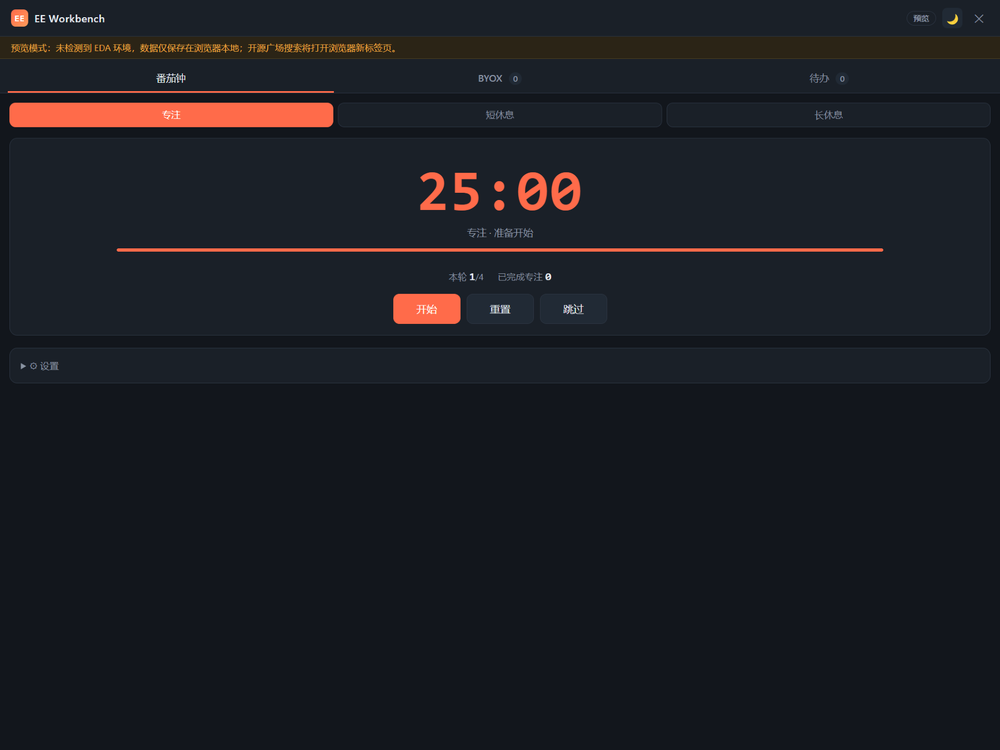
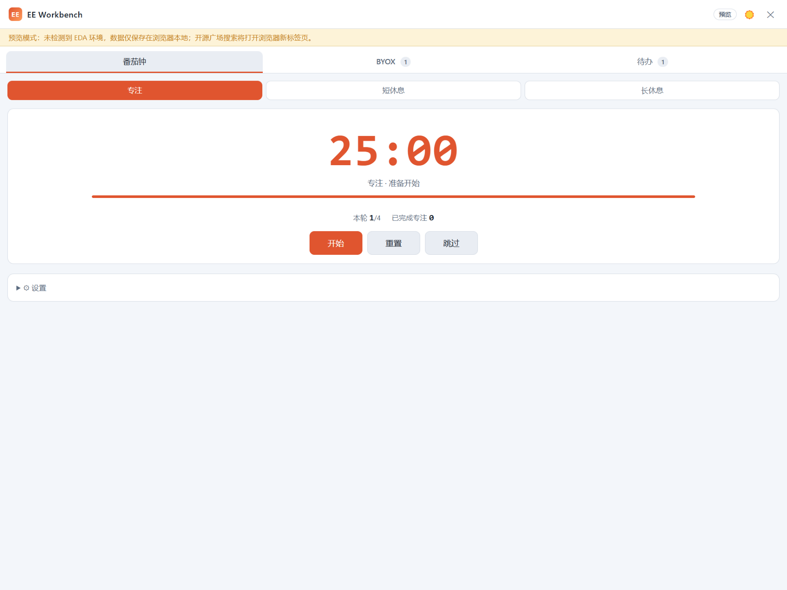
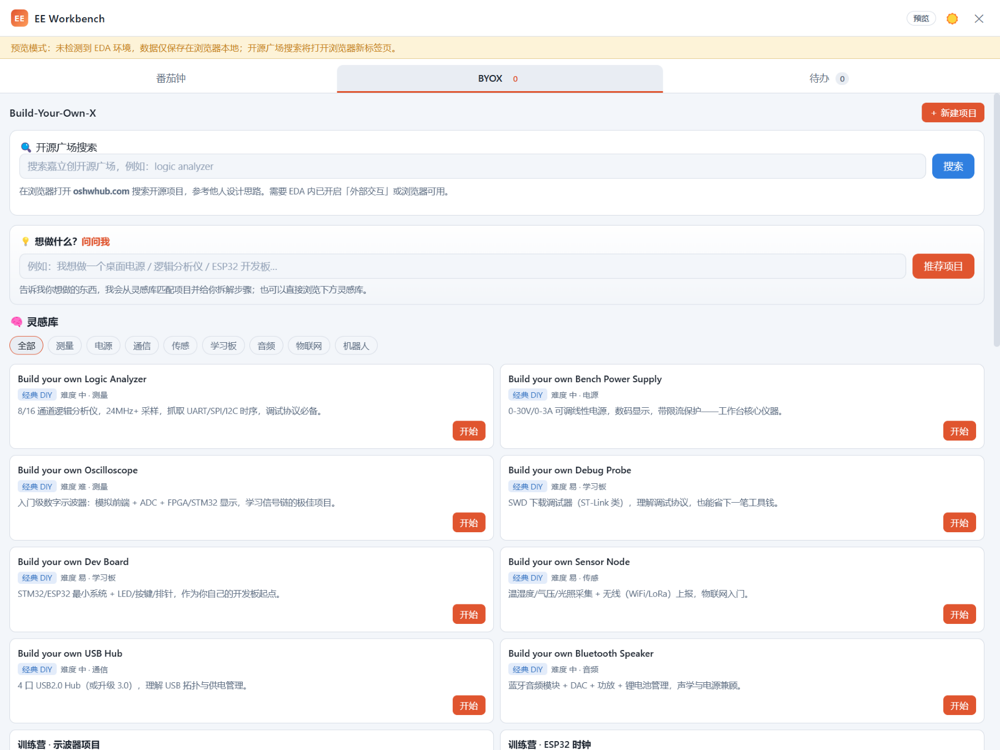
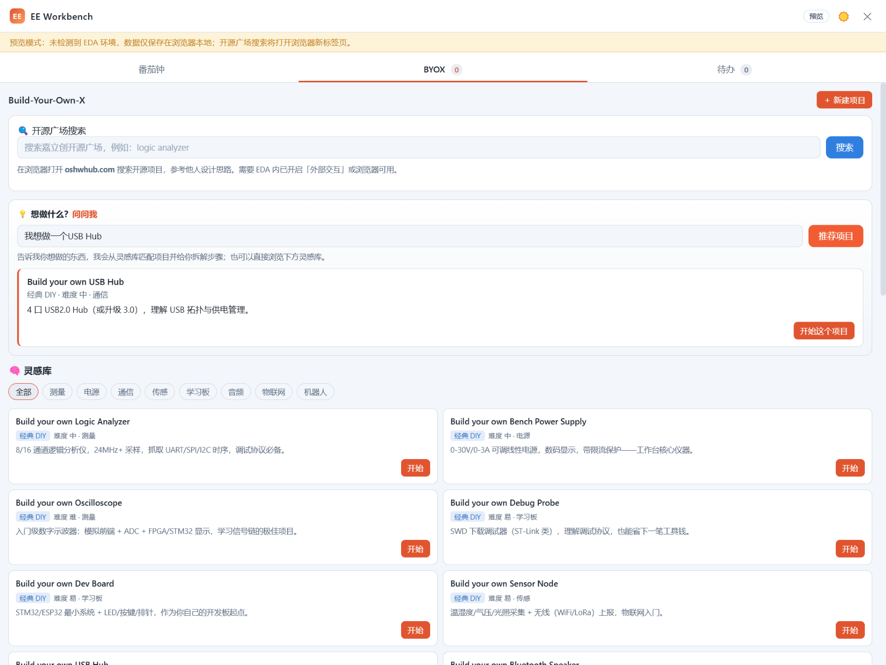
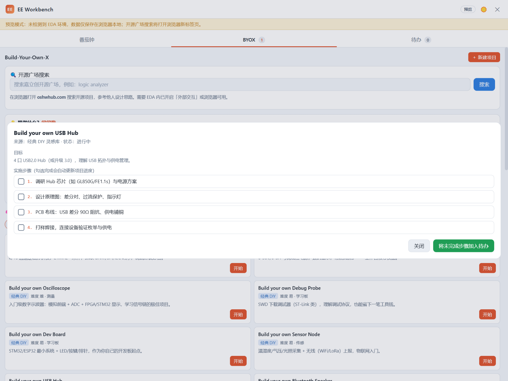
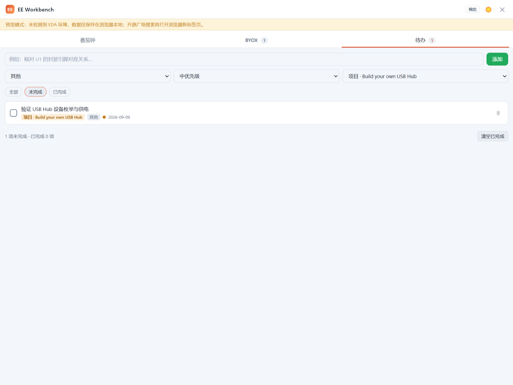

# EE Workbench

EE Workbench 是一个面向硬件工程师、PCB 设计者、嵌入式开发者和电子爱好者的效率工作台插件。

它把日常开发中常用的几类小工具整合到一个工作台窗口中，帮助你在原理图设计、PCB 布局、硬件调试、项目记录和任务管理之间保持更稳定的节奏。

当前版本主要包含：

- **番茄钟**：用于专注设计、调试或学习
- **build-your-own-x**：灵感库 + 问询式项目引导，把想做的硬件项目一步步拆解成计划
- **待办清单**：管理当前任务、Bug、实验记录和后续优化项，支持关联项目

它不是一个复杂的重量级工具，而更像是一块放在工作台边上的小面板：当你需要专注、记录、规划时，可以快速打开它。

## 功能演示

> 截图来自 v1.1.0 工作台（预览模式）。

### 番茄钟（支持深色 / 浅色主题）

| 深色主题 | 浅色主题 |
|---|---|
|  |  |

### build-your-own-x：灵感库与问询引导



输入「我想做一个 XX」，自动匹配灵感库并给出推荐：



「开始」一个项目后自动生成分步实施计划，可一键把未完成步骤加入待办：



### 待办清单（支持关联项目）



## 功能介绍

### 番茄钟

番茄钟用于帮助你进入专注状态，适合以下场景：

- 画原理图时避免频繁分心
- 调试 PCB 问题时保持连续观察
- 阅读数据手册、参考设计或技术文档
- 学习新模块、新协议、新工具链

你可以用它来规划一个专注周期，例如：

- 25 分钟专注设计
- 5 分钟休息
- 完成若干轮后进行一次较长休息

计时基于时间戳计算，即使窗口最小化或短暂挂起也能保持准确；专注结束时会有提示音与消息提醒，可配置自动进入休息。

### build-your-own-x

`build-your-own-x` 模块不只是项目记录，更是一个**项目教练**：帮你找到想做的项目，并把它们拆解成可执行的计划。

**灵感库**（内置 25 个项目）：

- 8 个经典 DIY 项目：逻辑分析仪、桌面电源、示波器、下载调试器、开发板、传感器节点、USB Hub、蓝牙音箱
- 嘉立创训练营全部 17 门课程：示波器、ESP32 时钟、温湿度计、涂鸦智能灯、CW32 电机、语音识别等

按「测量 / 电源 / 通信 / 传感 / 学习板 / 音频 / 物联网 / 机器人」分类浏览，每项带难度、目标与教程链接。

**问询式引导**：输入「我想做一个 XX」，自动匹配灵感库并给出项目推荐与拆解步骤。

**项目计划**：从灵感库「开始」一个项目，自动生成分步实施计划；勾选步骤实时更新进度；可一键把未完成步骤生成到待办清单。

**开源广场搜索**：输入关键词，通过 EDA 打开嘉立创开源广场（oshwhub.com）搜索页，参考他人开源设计（需在扩展管理器开启「外部交互」）。

自己的项目也可以直接「＋ 新建项目」记录名称、目标、参考资料、状态与进度。

### 待办清单

待办清单用于管理当前正在进行的小任务。

例如：

- 检查原理图网络标签
- 确认封装引脚对应关系
- 核对 BOM 物料
- 记录调试中发现的问题
- 整理 PCB 布局优化项
- 记录下一次打板前需要修改的内容

它适合把零散任务从脑子里转移到清单中，避免在复杂设计过程中遗漏细节。待办支持**关联项目**：从 BYOX 项目计划一键生成的步骤自动带上「项目 · 项目名」标签，方便按项目跟踪进度。

### EDA 集成

在原理图 / PCB 环境中，菜单提供「统计当前原理图并记入待办」「统计当前 PCB 并记入待办」：

- 原理图：统计元件、端口、文本、导线数量
- PCB：统计元件、走线、焊盘、过孔数量

一键把当前设计的规模快照写入待办清单，方便作为阶段检查项或交付核对记录。

## 适用场景

EE Workbench 适合以下人群：

- 硬件工程师
- PCB 设计者
- 嵌入式开发者
- 电子爱好者
- 创客
- 正在学习硬件开发的人

尤其适合在以下时候使用：

- 长时间画原理图或 PCB
- 调试硬件问题
- 整理项目资料
- 规划 DIY 硬件项目
- 记录学习路线和实验任务

## 插件信息

- **插件名称**：ee-workbench
- **显示名称**：EE Workbench
- **UUID**：`a1382f928de247fd85d603bca1c30c39`
- **简介**：一个面向硬件工程师的效率工作台，包含番茄钟、build-your-own-x 项目管理和待办清单。
- **分类**：通用工具（home / 原理图 / PCB）
- **最低版本**：嘉立创 EDA 专业版 V3（`engines.eda: ^3.2.0`）
- **License**：MIT

## 工程结构

```
ee-workbench/
├─ extension.json           扩展配置（名称、UUID、菜单注册）
├─ package.json             NPM 构建配置
├─ tsconfig.json            类型配置（允许纯 JS 源码）
├─ .edaignore               打包排除规则
├─ build/                   打包脚本（.eext 生成）
├─ config/                  esbuild 构建配置
├─ iframe/
│  └─ workbench.html        EE Workbench 工作台界面（番茄钟 / BYOX / 待办）
├─ images/
│  └─ logo.png              插件图标（1:1 PNG）
├─ locales/                 多语言文件（含 extensionJson 本地化）
├─ src/
│  ├─ index.js              扩展入口（菜单函数）
│  ├─ pomodoro.js           番茄钟数据模型与逻辑
│  ├─ build-your-own-x.js   DIY 项目数据模型与存储
│  └─ todo.js               待办数据模型与存储
├─ README.md
├─ CHANGELOG.md
└─ LICENSE
```

## 开发说明

本插件基于嘉立创 EDA 专业版扩展开发框架（pro-api-sdk）开发，入口为 `src/index.js`，通过 JavaScript 调用扩展 API 实现交互逻辑。

- `extension.json` 中的 `name` 不能与其他插件重复
- 插件已配置唯一 `uuid`
- 入口文件路径与 `extension.json` 中的 `entry`（`./dist/index`）一致
- 插件使用 `eda.sys_IFrame.openIFrame` 打开工作台窗口，使用 `eda.sys_Storage` 持久化数据
- 开源广场搜索通过 `eda.sys_Window.open` 打开外部浏览器，需要联网，需在扩展管理器中开启“外部交互”；其余功能完全本地

### 构建

环境要求：Node.js ≥ 20.17.0。

```shell
npm install
npm run build
```

构建产物（`.eext`）生成在 `build/dist/` 目录：

```
build/dist/ee-workbench_v1.1.0.eext
```

### 本地调试

在嘉立创 EDA 专业版中打开扩展管理器，导入 `build/dist/ee-workbench_v1.1.0.eext`（或直接导入本工程目录），然后通过顶部菜单「EE Workbench」打开工作台。

## 安装方式

1. 在嘉立创 EDA 专业版中打开扩展管理器（顶部菜单栏 → 高级 → 扩展管理器…）
2. 导入本地插件目录或 `.eext` 文件
3. 在顶部菜单「EE Workbench」中打开工作台

## 数据存储说明

所有数据（番茄钟状态、项目、待办）均保存在嘉立创 EDA 专业版的扩展用户配置中（`eda.sys_Storage`），与具体工程文件无关，跨工程共用一份。

## 后续可扩展方向

后续可以继续扩展更多硬件工程师常用的小工具，例如：

- 单位换算：电阻、电容、电感、功率、电流等
- 封装速查：常用封装尺寸与检查项
- 引脚检查清单：电源、地、去耦、复位、使能等
- BOM 整理辅助：物料分类、备注、替代料记录
- 调试日志：记录问题现象、测量结果、修改方案
- 项目模板：电源模块、传感器模块、通信模块等

## License

MIT
