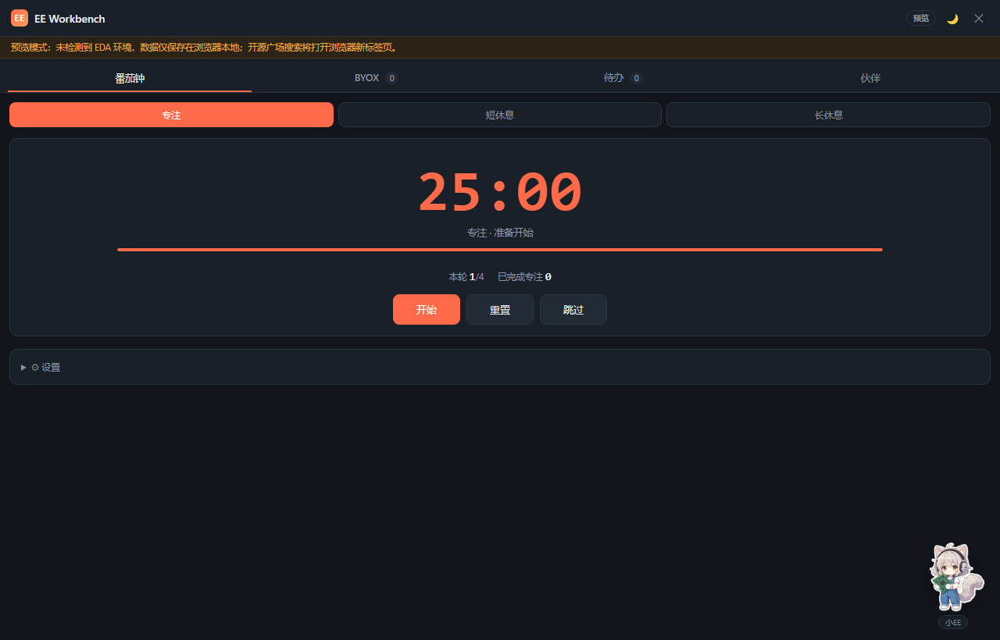

# EE Workbench：为硬件工程师打造的嘉立创 EDA 效率工作台

> 一个开源的嘉立创 EDA 专业版扩展，集成番茄钟、DIY 项目引导、待办清单与桌面伙伴，帮助硬件工程师在原理图设计、PCB 布局和调试之间保持工作节奏。

## 背景

硬件开发有一个很现实的问题：一个完整的设计流程往往被切碎在原理图、PCB、数据手册、调试和物料核对之间，一次专注很难超过半小时，零散的待办事项也容易在复杂的工程中被遗漏。

我自己日常用嘉立创 EDA 专业版做设计，一直在找一个轻量的侧边工具，能把"保持专注节奏"和"记录零散任务"这两件事管起来。市面上的效率插件要么是通用番茄钟，要么是笨重的项目管理，没有专门面向硬件设计场景的。于是就自己写了一个，起名 **EE Workbench**，开源分享出来。

## 功能模块

### 1. 番茄钟

标准的专注 / 短休 / 长休三档循环，默认 25 分钟专注、5 分钟休息、四番茄一长休。设计参数可调。

与普通番茄钟的区别是它和插件的桌面伙伴状态联动：专注期间桌宠自动进入工作姿态，休息时切换为放松姿态，用视觉反馈替代弹窗打断。

### 2. Build-Your-Own-X 项目引导

这个模块分两部分：

- **开源广场搜索**：直接在插件内检索嘉立创开源广场（oshwhub）上的项目，例如 `logic analyzer`、`power supply`、`oscilloscope`，参考他人成熟设计作为自己练手或设计的起点
- **灵感库**：预置了若干经典 DIY 硬件项目方向——数字示波器、可调电源、调试器、开发板、传感器节点等，每个方向点「开始」会自动拆解为可跟踪的步骤清单

它和待办清单的分工是：灵感库管"想做什么"，待办清单管"现在要做什么"。已经有明确项目想法的，直接在灵感库新建项目即可。

### 3. 待办清单

用于管理当前工程中的零散任务：原理图网络标签检查、封装引脚对应关系核对、BOM 物料确认、调试中发现的问题、下一次打板前需要修改的内容等。

从 BYOX 项目计划中拆出的步骤会自动带上项目标签，支持按项目过滤，避免跨工程任务混在一起。

### 4. 桌面伙伴

工作台右下角常驻一个二次元风格的工程师角色，会根据工作状态切换五种姿态：

| 状态 | 触发条件 |
|---|---|
| 待机 | 空闲时 |
| 专注工作 | 番茄钟运行中 |
| 休息放松 | 番茄钟休息阶段 |
| 完成庆祝 | 任务完成时 |
| 打盹 | 长时间无操作 |

支持拖拽到屏幕任意位置、靠近边缘自动吸附、点击有交互反馈，位置和设置自动记忆。支持深色 / 浅色主题。角色立绘为 AI 生成，采用 CC BY-NC 4.0 协议授权。

## 安装

1. 在嘉立创 EDA 专业版中打开「设置 → 扩展 → 扩展管理器」
2. 搜索 **EE Workbench** 直接安装，或导入本地 `.eext` 文件
3. 如需要使用开源广场联网搜索功能，在扩展管理器中开启「外部交互」
4. 通过顶部菜单「EE Workbench → 打开 EE Workbench」启动面板

## 开源信息

- GitHub 仓库：https://github.com/Duckweed-yhb/EE-Workbench
- 代码采用 MIT 协议，欢迎提交 Issue 或 Pull Request
- 角色立绘采用 CC BY-NC 4.0 协议（可分享与二次创作，需署名，禁止商用）
- 纯前端实现，基于嘉立创 EDA 扩展框架，不收集任何用户数据

后续计划加入单位换算、封装速查、BOM 整理等硬件工程师常用小工具。如果在使用中遇到问题或有功能建议，欢迎到 GitHub 提 Issue。
