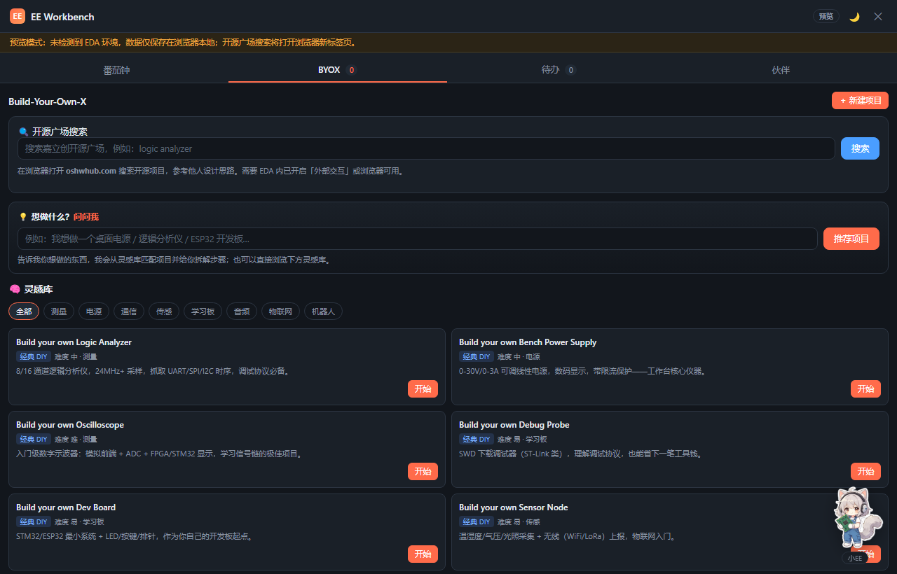
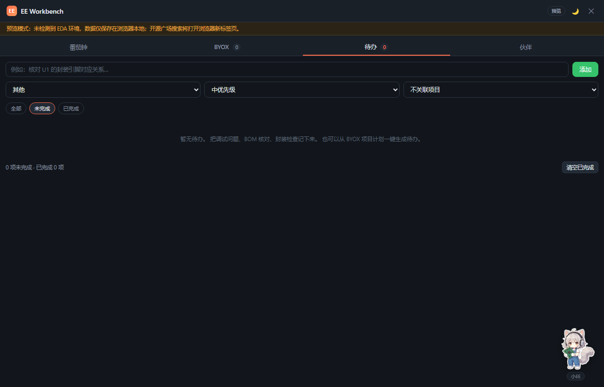
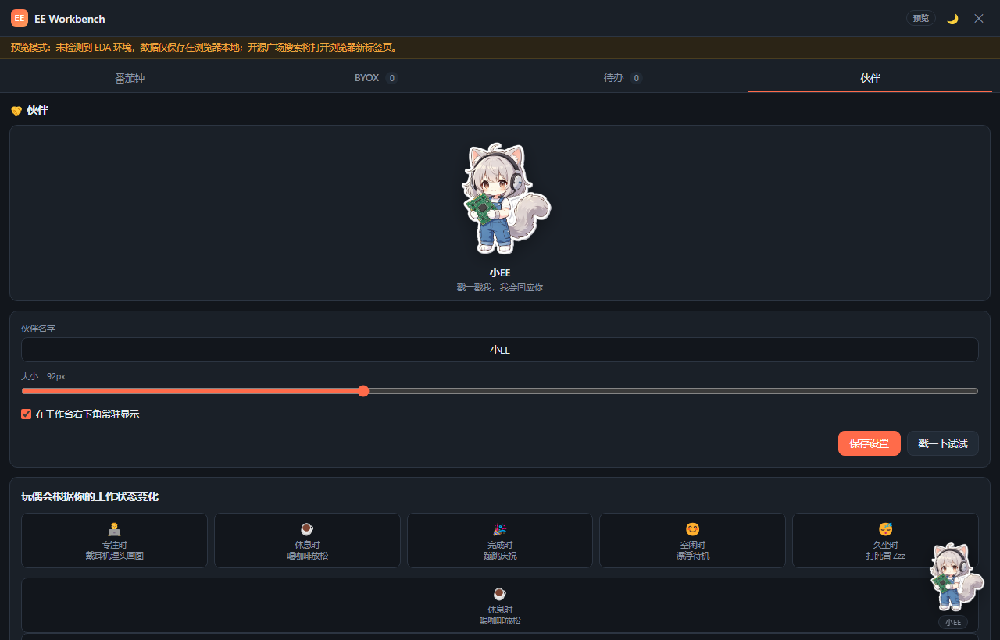

# EE Workbench · 硬件工程师的效率工作台（带猫娘桌宠）

> 一个嘉立创 EDA 专业版的效率插件：番茄钟 + DIY 项目引导 + 待办清单，外加一只会随你工作状态变化的猫娘桌宠。

## 这是什么

EE Workbench 是我给自己写的一个嘉立创 EDA 专业版扩展。硬件设计经常一坐就是两三个小时，原理图、PCB、调试、看手册混在一起，容易分心也容易忘事。这个插件把日常最常用的几个小工具整合到工作台侧边：

- **番茄钟**：25 分钟专注 / 5 分钟休息，跟桌宠状态联动
- **Build-Your-Own-X**：记录自己的 DIY 项目，也能从开源广场找灵感、跟着练手
- **待办清单**：管理调试任务、BOM、封装检查，还能关联到具体项目
- **猫娘桌宠**：右下角常驻一只猫娘工程师，看你工作、陪你摸鱼、庆祝你完成任务

## 它长什么样

### 番茄钟

标准的专注 / 短休 / 长休三档，四番茄一长休。开始专注后，右下角的猫娘会自动低头焊电路板；休息时她会捧起一杯咖啡。

### BYOX 项目引导

分两块：

- **开源广场搜索**：直接在插件里搜嘉立创开源广场上的项目（logic analyzer / power supply / oscilloscope …），参考别人的设计思路
- **灵感库**：预置了几个经典 DIY 项目（示波器、电源、调试器、开发板、传感器节点），点「开始」会自动拆成步骤，边做边勾

如果你自己已经有项目想法，直接新建项目就行；想找点事做，就从灵感库挑一个开始。

### 待办清单

调试时发现的问题、下一次打板前要改的点、BOM 还缺哪些物料，都丢进来。从 BYOX 项目计划拆出来的步骤会自动带上「项目 · 项目名」标签，方便按项目过滤。

### 猫娘桌宠

这是这个插件最不一样的地方。右下角常驻一只猫娘工程师，她会：

| 状态 | 她在干嘛 |
|---|---|
| 待机 | 抱着电路板看你 |
| 专注（番茄钟运行） | 低头焊板 |
| 休息 | 闭眼捧咖啡 |
| 完成任务 | 举手撒花庆祝 |
| 空闲 60 秒 | 趴桌打盹冒 Zzz |

点她会回你一句工程师台词；按住可以拖到屏幕任意位置，靠近边缘会自动吸附；位置自动记住。深色 / 浅色主题都适配。

## 怎么安装

1. 在嘉立创 EDA 专业版打开「设置 → 扩展 → 扩展管理器」
2. 导入本地 `.eext` 文件，或直接从扩展广场搜索 **EE Workbench** 安装
3. 如果插件需要联网搜开源广场，在扩展管理器里勾选「外部交互」
4. 顶部菜单「EE Workbench → 打开 EE Workbench」即可

## 开源信息

- GitHub：https://github.com/Duckweed-yhb/EE-Workbench
- 代码采用 MIT 协议，欢迎提 Issue / PR
- 猫娘立绘为 AI 生成，采用 CC BY-NC 4.0（可分享二创，需署名，禁止商用）
- 基于嘉立创 EDA 专业版扩展框架开发，JavaScript / 纯前端，不收集任何数据

如果你用了觉得哪里不顺手，或者想加个小工具（单位换算 / 封装速查 / BOM 整理 …），欢迎到 GitHub 提 Issue。\n\n---\n\n**当前版本：v1.4.2** · 更新记录见 [releases/](releases/)
